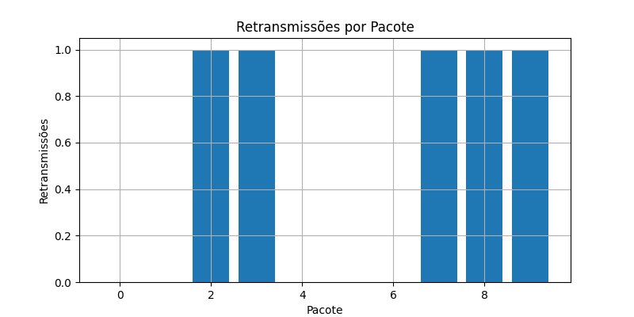
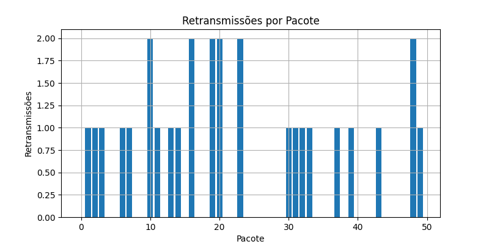
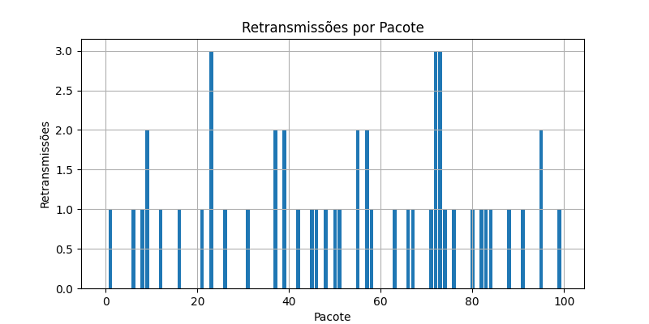
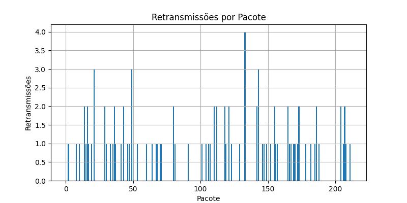
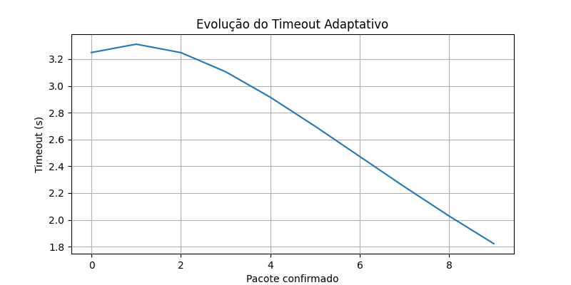
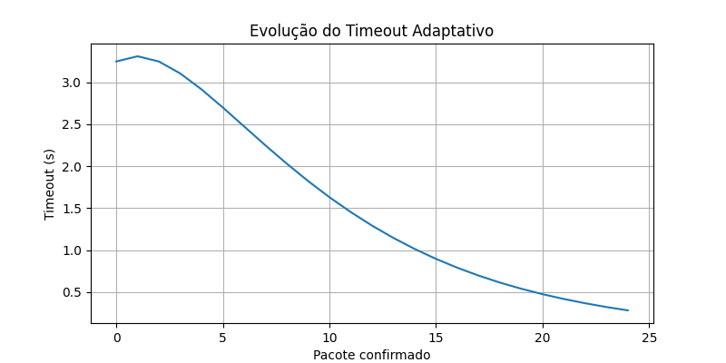
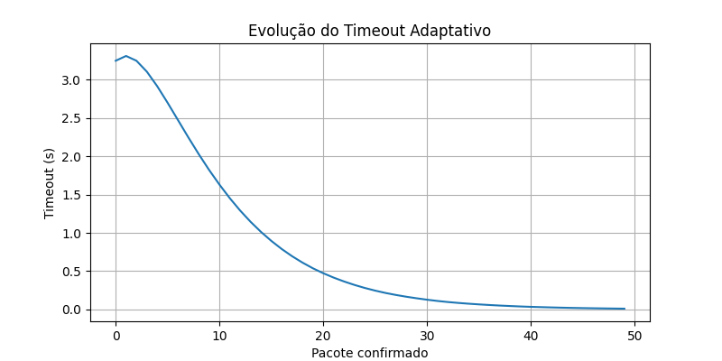
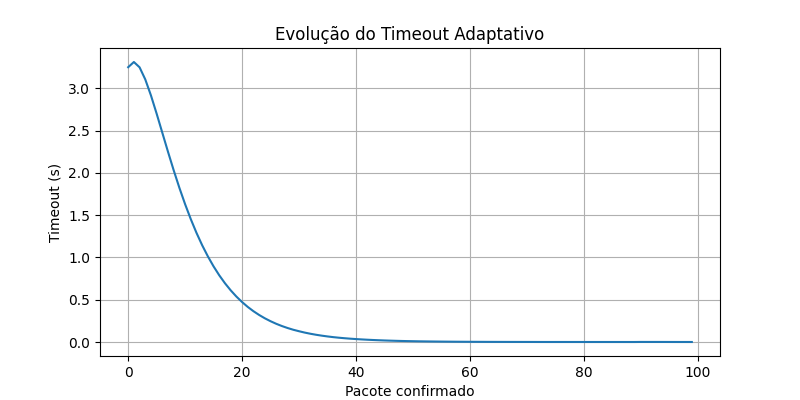
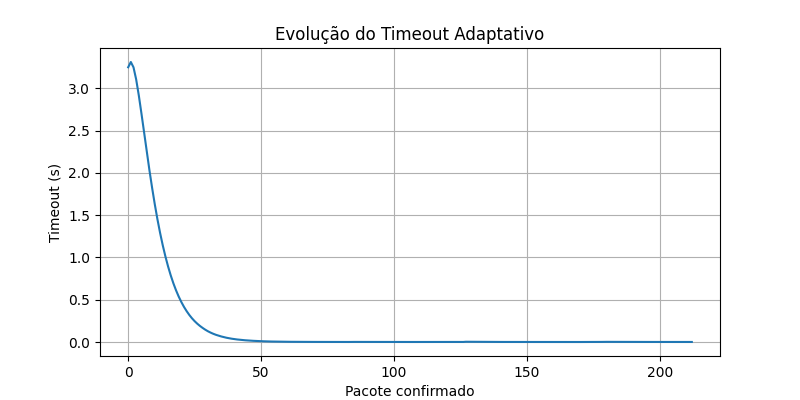

# RELATÓRIO — Implementação Protocolo RDT 3.0

Aluno: Fernando Nunes de Freitas
Matricula: 22/2014661
Professor: Jacir Luiz Bordim
Curso: Engenharia de Computação
Instituição: Universidade de Brasilia
Disciplina: Teleinformática e Redes 2
Data: 08/11/2025

## Introdução

A comunicação utilizando o protocolo UDP não fornece garantias de entrega, ordem ou integridade dos dados.
Para suprir essas limitações, estudamos e implementamos o protocolo RDT 3.0 (Reliable Data Transfer), utilizando o mecanismo Stop-and-Wait ARQ para:

- Garantir entrega confiável
- Detectar e corrigir perdas e corrupção
- Manter a ordem dos pacotes

## Objetivos

Desenvolver uma implementação confiável de camada de transporte sobre UDP

* Realizar tratamento de:
- perda de pacotes
- corrupção do conteúdo
- duplicação de ACKs
- Utilizar timeout dinâmico, baseado em cálculo de RTT
- Coletar e analisar métricas de desempenho

## Descrição do Sistema

O projeto utiliza três scripts principais:

Arquivo	Função
* rdt_client.py - Cliente
* rdt_server.py - Servidor
* main.py - Controla execução e coleta métricas

Além de um arquivo mensagens.txt definindo os dados enviados.

* RTT Estimado — TCP

EstimatedRTT = (1 - α)*EstimatedRTT + α*SampleRTT
DevRTT = (1 - β)*DevRTT + β*|SampleRTT − EstimatedRTT|
TimeoutInterval = EstimatedRTT + 4 * DevRTT

## Metodologia de Testes

4 cenários foram testados variando o tamanho da carga útil:

|Teste| Nº de mensagens	|Estado do canal|
|:---:|:---------------:|:-------------:|
|  T1 |	10	Perdas      |moderadas      |
|  T2 |	50	Perdas      |moderadas      |
|  T3 |	100	Perdas      |altas          |
|  T4 |	200	Perdas      |altas          |

Configuração no servidor:

- PACKET_LOSS_PROB = 0.2 - Probablidade perda de Pacotes
- ACK_LOSS_PROB = 0.1    - Probalidade perda de ACK
- CORRUPT_PROB = 0.1     - Probablidade de Corrupção

## Resultados

* Após cada cenário, o programa exibe:

Tempo total, ACKs recebidos, Retransmissões, Taxa de Retransmissões, Throughput (Kbps)

|Teste |Nº Msg|	Tempo Total (s)	|ACKs   |Retransm.  | % Retransmissão |	Throughput (Kbps)  |
|:----:|:----:|:---------------:|:-----:|:---------:|:---------------:|:------------------:|
|T1	   |10    | 13.365          |  10   |     05    |   33.33%        |       0,10         |
|T2	   |25	  | 23.481          |  25   |     14    |   35.90%        |       0.14         |
|T3	   |50	  | 25.870          |  50   |     28    |   35.90%        |       0.26         |
|T4    |100   | 14.630          |  100  |     49    |   32.89%        |       0.84         |
|T5    |213   | 14.265          |  213  |     95    |   30.84%        |       2.05         |

## Gráficos

# Gráfico 1 — Retransmissões por Pacote

# Gráfico 2 — Timeout Adaptativo ao longo da transmissão

## Desenvolvimento

Observa-se que o tempo total não cresce proporcionalmente ao número de mensagens.
Exemplo:
10 → 13,36 s
213 → 14,26 s (quase o mesmo tempo com 21× mais pacotes)

* Retransmissões e taxa de perda

A taxa de retransmissão se manteve entre 30% e 36%, mesmo aumentando o número de mensagens.

Isso indica que:

- O canal manteve a mesma qualidade ruim afetando todos os testes
- O protocolo foi capaz de se adaptar e continuar entregando mensagens
- Prova de que o RDT 3.0 garante confiabilidade, mesmo em canal ruim

* Crescimento do Throughput

Aqui vemos o melhor indicador de desempenho:

Msg ↑	Throughput ↑
10 msgs → 0,10 Kbps
213 msgs → 2,05 Kbps

- Por que enviar mais pacotes aumenta o throughput?

Porque no Stop-and-Wait, o emissor passa grande parte do tempo ocioso, esperando ACKs:

- Pior para mensagens curtas → pouca transmissão e muito tempo parado
- Melhor para lotes maiores → o tempo perdido é diluído

* Comportamento do Timeout Adaptativo

À medida que mais pacotes foram enviados, o algoritmo de cálculo:

Cálculo	Benefício
Estimated RTT	Se adapta ao atraso real
DevRTT	Mede variação do atraso
Timeout Interval	Minimiza retransmissões desnecessárias

- No início: tempo limite muito longo
- Durante o teste: Timeout fica mais justo e eficiente
- Resulta em menos espera desnecessária e recuperação mais rápida de perdas

## Conclusão

✔ O RDT 3.0 foi implementado com sucesso
✔ A transmissão ocorreu com entrega garantida e ordenada
✔ O protocolo corrigiu erros automaticamente

## Referências

KUROSE, J.; ROSS, K. Redes de Computadores e a Internet – 8ª edição
RFC 6298 — Computing TCP’s Retransmission Timer
Documentação Oficial — Python Sockets